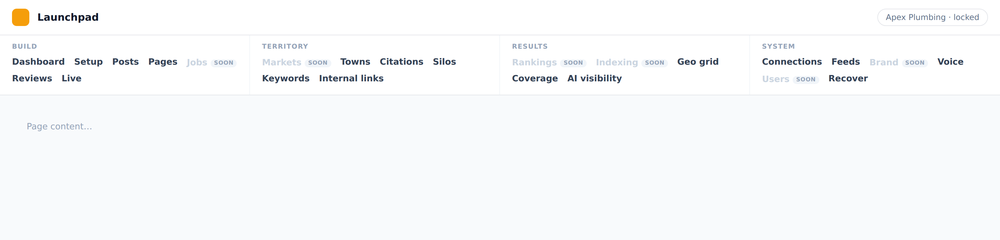
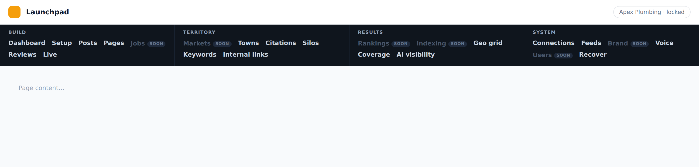
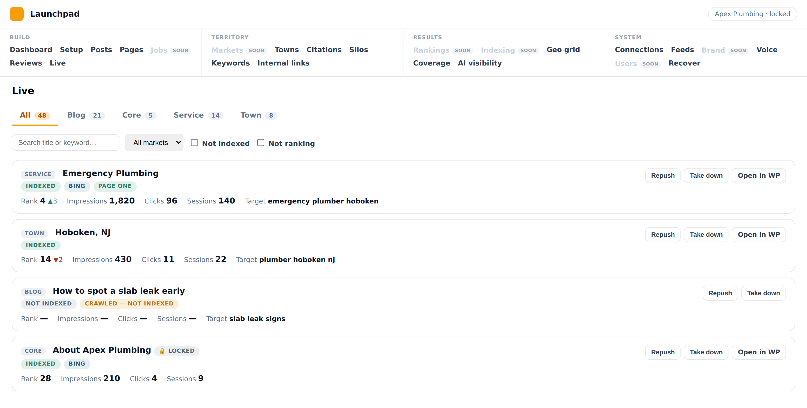
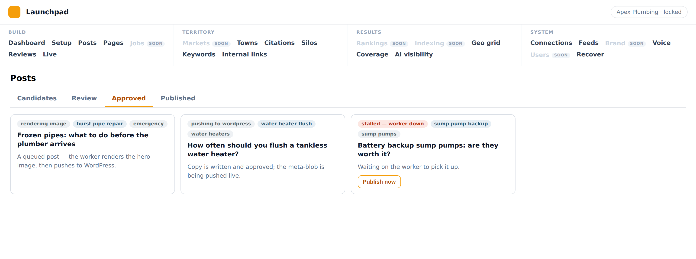
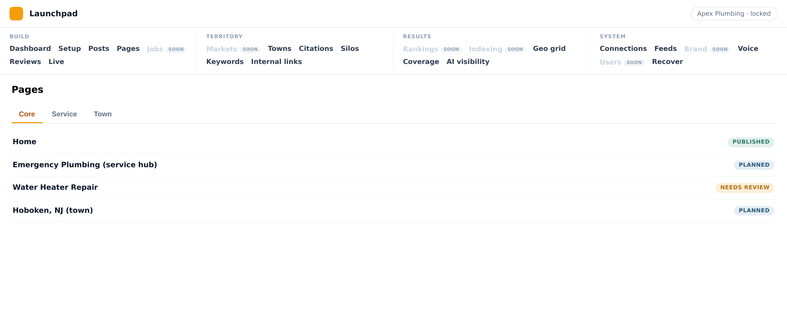
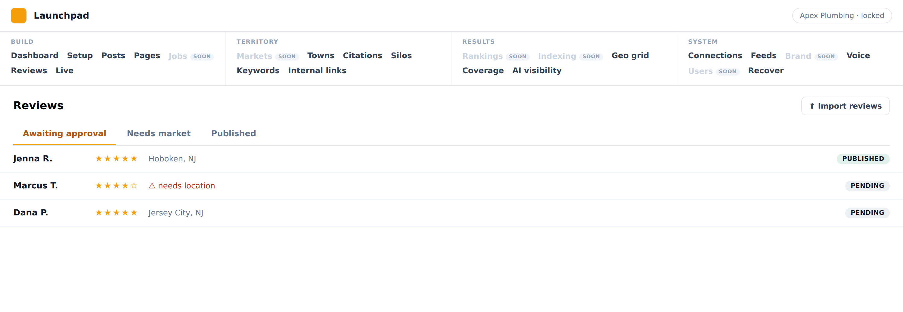

# PR 5 — Navigation cutover (header-only, 4 groups, 24 items)

The final operator IA. Header-only nav (no sidebar), four groups, no dropdowns,
exactly **24 items**. Some items are single surfaces; five are **tabbed**
consolidations of surfaces that are separate nav entries today. Vocabulary is
settled — use the names below verbatim.

This doc is the authoritative mapping (the relay's "PR 5 — Navigation"). It is
the recovery record: the cutover can be rebuilt from it alone.

## The four groups (exact order, exact items)

| Build | Territory | Results | System |
| --- | --- | --- | --- |
| Dashboard | Markets | Rankings | Connections |
| Setup | Towns | Indexing | Feeds |
| Posts | Citations | Geo grid | Brand |
| Pages | Silos | Coverage | Voice |
| Jobs | Keywords | AI visibility | Users |
| Reviews | Internal links | | Recover |
| Live | | | |

Build 7 · Territory 6 · Results 5 · System 6 = **24**.

## Tabs (NOT nav items)

- **Posts** → Candidates · Review · Approved · Published
- **Pages** → core · service · town
- **Jobs** → queue · published
- **Reviews** → Awaiting approval · Needs market · Published · Import
- **Towns** → its own board **plus** Tier progression and Link plans as tabs
  (Tier progression and Link plans are NOT nav items).

## Settled decisions (restate + confirm in the PR body)

1. **Header-only** — `->topNavigation()`, no sidebar. No dropdowns.
2. **Lobby is outside the panel entirely** (the 2b decision) — NOT a top-level
   nav item. The panel opens on a locked tenant; Lobby is the standalone picker.
3. **Live is Build, not Results.** Results is measurement only — no queues, no
   publishing surfaces live there.
4. **Targeting is not an item.** It splits into **Silos**, **Keywords**, and
   **Internal links**, all under Territory.
5. **Jobs is a Build item.** Jobs and Reviews are both proof-capture queues and
   sit beside Posts and Pages.
6. **Vocabulary:** **Markets** (not Locations / Service area). **Towns** (not
   Coverage). **Coverage** under Results is *coverage progress* (measurement),
   distinct from Towns.
7. **Brand and Users are System.**
8. **Internal links** is a Territory item; **Tier progression** and **Link
   plans** are tabs inside Towns.
9. **Planned display** (acceptance 19, landed on this branch): a candidate PAGE
   reads "Planned" in the state chip (display-only; no enum/migration).
10. **Legacy: retire from nav, keep routes.** Superseded surfaces leave the nav
    (no entry) but their routes stay reachable. Nothing is deleted.
11. Portfolio (`SiteResource` nav entry) and Overview fold into the Lobby.

## Standing rules for every UI PR (from here on)

1. **Screenshot in the PR body — not a description.**
2. **Every displayed number gets its query written next to it, with a verified
   live value.**
3. **Acceptance criteria encode placement, not just existence.**
4. **Restate the spec's design decisions in the PR body and confirm each.**
5. **Shared card and badge components — one implementation**, used by Lobby,
   Dashboard, and boards.

## Item → surface mapping

Three tiers: **REGROUP** (surface exists, just move/unhide/relabel), **TABS**
(consolidate separate surfaces into one tabbed item — no `getTabs()` infra
exists anywhere in the admin panel today; only `OperateBlog` has a custom
`$tab`), **GAP** (no admin surface exists — must be built or ported).

| # | Item | Group | Surface | Tier |
| --- | --- | --- | --- | --- |
| 1 | Dashboard | Build | `Operate\TenantDashboard` (`tenant-dashboard`, hidden) | REGROUP (unhide) |
| 2 | Setup | Build | `Gathering\SetupEntry` (`setup2`) | REGROUP |
| 3 | Posts | Build | `Operate\OperateBlog` (`operate/blog`), custom `$tab` = candidates/review/published | TABS (add **Approved**) |
| 4 | Pages | Build | merge `Operate\OperateCorePages`+`OperateServicePages`+`OperateLocationPages` (share abstract `OperatePagesBoard`) | TABS (core·service·town) |
| 5 | Jobs | Build | console-panel `Console\Pages\JobReview`+`PublishedJobs` only | **GAP** (queue·published) |
| 6 | Reviews | Build | `Resources\ReviewCaptureResource` + `ReviewImportPage` | TABS (Awaiting·Needs market·Published·Import) |
| 7 | Live | Build | 3× `Pages\Live\Live{Locations,Services,CorePages}` (+ hidden `PublishedContentResource`) | TABS (→1 item) |
| 8 | Markets | Territory | no `MarketResource`/page; `Market` model only | **GAP** |
| 9 | Towns | Territory | `LocationsSetup` (or `OperatePhysicalLocations`) + fold `OperateTierProgression` + `OperateLinkPlans` as tabs | TABS |
| 10 | Citations | Territory | `Citations\CitationsPortfolio` (`citations`) | REGROUP |
| 11 | Silos | Territory | `Resources\SiloManagementResource` (hidden) | REGROUP (unhide) |
| 12 | Keywords | Territory | `Resources\KeywordResource` (hidden, "Targets & gaps") | REGROUP (unhide, relabel) |
| 13 | Internal links | Territory | `Operate\InternalLinks` (`operate/internal-links`) | REGROUP |
| 14 | Rankings | Results | service `Operator\Coverage\PositionTracking` only, no page | **GAP** |
| 15 | Indexing | Results | service `Operator\IndexCoverage` only, no page | **GAP** |
| 16 | Geo grid | Results | `Pages\LocationGeoGrid` (`geo-grid`) | REGROUP |
| 17 | Coverage | Results | `Pages\LocationCoverage` (`coverage-progress`) | REGROUP |
| 18 | AI visibility | Results | `Pages\GeoActivityConsole` (`geo-activity`) | REGROUP (relabel) |
| 19 | Connections | System | `Resources\ConnectionsResource` | REGROUP |
| 20 | Feeds | System | `Resources\SourceResource` (Feeds) | REGROUP |
| 21 | Brand | System | only `Gathering\BrandStep`/`Guided\Brand` steps; service `Branding\BrandStudio` | **GAP** (standalone) |
| 22 | Voice | System | `Resources\VoiceProfileResource` | REGROUP |
| 23 | Users | System | no `UserResource`; console `Console\Pages\UsersAccess` only | **GAP** |
| 24 | Recover | System | `Operate\RebuildReadiness` (`operate/readiness`, "Readiness") | REGROUP (relabel) |

**Totals: 13 REGROUP · 5 TABS · 6 GAP.** `topNavigation()` is supported
(Filament v5). No `getTabs()` infra, no `UserResource`, no `MarketResource`
exist today.

## Shipped shell (5b)

The four-column header, rendered (18 live links + the 6 greyed "soon" gaps):

## 5e — Live consolidation (spec)

**Five published boards collapse into one "Live" board with a type filter** —
Blog, Core, Service, Town, **and Storefront** (not just the three page boards).
It is ONE dataset with a type selector, not five views.

- **Type selector (tabs, but a filter over one dataset):** All · Blog · Core ·
  Service · Town — each with a live count. **All is the default** and is the
  point: one place to answer "what's live and what's wrong with it."
- **Filter row:** search · Market · Not indexed · Not ranking.
- **One card component per row** (carries a type label, since All mixes them):
  - **flags:** Indexed · Bing · Page one · plus any `page_index_states` problem reason
  - **rank** with delta
  - **impressions** · **clicks** · **sessions**
  - **target keyword**
  - **actions:** Repush · Take down · Open in WP

Every displayed number gets its query documented + a verified value (standing
rule). The five legacy boards retire from nav, routes kept.

**Clarifications (locked):**
- **One card component** — the flat `x-lp.content-card` (flags via the shared
  `x-lp.chip`), used here and adoptable by the dashboard/lobby/boards. The
  grouped Locations layout does NOT survive; every row is one flat card.
- **Storefront is not a separate type** — it is a `location_id` pin on
  `page_type=Location` pages, so it folds under the **Town** bucket.
- **`assignLocation` / `reassign` do NOT move to Live** — they are orphan/
  served-town assignment, not live-page actions; they belong with **Towns**
  (Territory). Live carries only repush / take-down / regenerate + Open in WP.

### Shipped: 5f — Posts "Approved" tab

The Posts (blog) board gains the missing **Approved** tab (Candidates · Review ·
**Approved** · Published) — approved-and-queued-to-publish posts get their own
tab, backed by the pre-existing `BlogBoard::approved()`. Each card shows its
publish-flow state (queued / rendering image / pushing to WordPress) + a stalled-
worker flag with the per-post `publishNowSync` escape hatch.

## 5g — Towns consolidation (spec)

**Towns → its own board + Tier progression + Link plans as tabs.** The three
per-surface pages (`LocationsSetup` "Service area", `OperateTierProgression`,
`OperateLinkPlans`) collapse into one tabbed **Towns** surface. Per the 5e steer,
the orphan-assignment actions **`assignLocation` / `reassign`** (currently on the
Live Locations board) land **here** — they are served-town assignment, not
live-page actions. The legacy per-surface pages retire from nav, routes kept.

## Sequencing (honoring the standing UI-PR rules)

Building 6 new surfaces + 5 tab-consolidations + the regroup as one PR cannot
carry a per-surface screenshot / verified-number / placement acceptance. So the
cutover is an ordered epic:

- **5b — Nav shell + regroup:** `topNavigation()`, the 4 groups, wire the 13
  REGROUP items (unhide/relabel), retire Portfolio + Overview from nav (routes
  kept), rewrite the 4 nav test files (`NavFinalTest`, `NewMenuTest`,
  `MenuMap`, `NewMenu::GROUP_ORDER`). Ships the IA with what exists; the TABS
  and GAP items are provisioned as they land.
- **5c…** — each TABS consolidation and each GAP surface as its own focused PR
  (Pages tabs, Reviews tabs, Live, Towns tabs, Posts Approved; then Jobs,
  Markets, Rankings, Indexing, Brand, Users), each with its screenshot +
  verified-number queries.

### Shipped: 5c — Pages consolidation

One "Pages" nav item → a board with **core · service · town** tabs (town = the
`locations` family); the three legacy per-family boards stay as off-nav routes.
The service board's site-level "Refresh rankings" action moved to the base so the
consolidated board carries it on every tab. **Planned display** landed here too:
`StateChip` (candidate page → "Planned") **and** `Content::buildStateLabel` now
read a candidate PAGE as "Planned", so the wording shows on PageResource / Grow /
the board.

### Shipped: 5d — Reviews consolidation

One "Reviews" surface: the review lifecycle as native `ListReviews::getTabs()` —
**Awaiting approval** (pending) · **Needs market** (`needs_location`, the
operator wording the Lobby shows as "reviews with no market") · **Published**.
The bulk **Import** flow folds in as a header action linking to the dedicated
`ReviewImportPage` (a full upload → map → preview → commit page, kept as a route).

Confirm the sequence + how to fill the 6 GAP surfaces (build new vs. defer vs.
point at nearest) before building 5c+.
