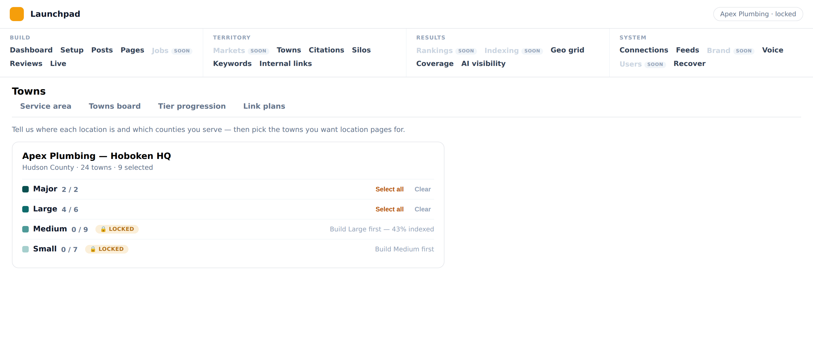

# PR 5 — Navigation cutover (header-only, 4 groups, 24 items)

The final operator IA. Header-only nav (no sidebar), four groups, no dropdowns,
exactly **24 items**. Some items are single surfaces; five are **tabbed**
consolidations of surfaces that are separate nav entries today. Vocabulary is
settled — use the names below verbatim.

This doc is the authoritative mapping (the relay's "PR 5 — Navigation"). It is
the recovery record: the cutover can be rebuilt from it alone.

## The four groups (exact order, exact items)

| Build | Territory | Results | System |
| --- | --- | --- | --- |
| Dashboard | Markets | Rankings | Connections |
| Setup | Towns | Indexing | Feeds |
| Posts | Citations | Geo grid | Brand |
| Pages | Silos | Coverage | Voice |
| Jobs | Keywords | AI visibility | Users |
| Reviews | Internal links | | Recover |
| Live | | | |

Build 7 · Territory 6 · Results 5 · System 6 = **24**.

## Tabs (NOT nav items)

- **Posts** → Candidates · Review · Approved · Published
- **Pages** → core · service · town
- **Jobs** → queue · published
- **Reviews** → Awaiting approval · Needs market · Published · Import
- **Towns** → its own board **plus** Tier progression and Link plans as tabs
  (Tier progression and Link plans are NOT nav items).

## Settled decisions (restate + confirm in the PR body)

1. **Header-only** — `->topNavigation()`, no sidebar. No dropdowns.
2. **Lobby is outside the panel entirely** (the 2b decision) — NOT a top-level
   nav item. The panel opens on a locked tenant; Lobby is the standalone picker.
   **No site switcher in the locked chrome** (tenant-lock remediation): the topbar
   shows the CURRENT tenant only (logo + name) plus **Exit site**; there is no
   dropdown of other tenants on any page. Changing tenant is Exit site → Lobby →
   enter — deliberate friction, and the reason no page carries another tenant's
   name in its chrome.
3. **Live is Build, not Results.** Results is measurement only — no queues, no
   publishing surfaces live there.
4. **Targeting is not an item.** It splits into **Silos**, **Keywords**, and
   **Internal links**, all under Territory.
5. **Jobs is a Build item.** Jobs and Reviews are both proof-capture queues and
   sit beside Posts and Pages.
6. **Vocabulary:** **Markets** (not Locations / Service area). **Towns** (not
   Coverage). **Coverage** under Results is *coverage progress* (measurement),
   distinct from Towns.
7. **Brand and Users are System.**
8. **Internal links** is a Territory item; **Tier progression** and **Link
   plans** are tabs inside Towns.
9. **Planned display** (acceptance 19, landed on this branch): a candidate PAGE
   reads "Planned" in the state chip (display-only; no enum/migration).
10. **Legacy: retire from nav; keep a route ONLY with a redirect.** A superseded
    surface leaves the nav, and its route is kept only where a redirect to the
    replacement is added; a surface with no replacement is deleted. An unrouted,
    unlinked, nav-retired surface is deleted — a live route with no nav entry
    accumulates stale references (a "Towns board" tab pointed at a retired board for
    a whole cutover) and stays URL-reachable to anyone with the link (this is what
    left seven cross-tenant resources reachable via `discoverResources`). "Hide,
    don't delete" is not the policy: retire the nav entry AND either redirect the
    route or delete it.
11. Portfolio (`SiteResource` nav entry) and Overview fold into the Lobby.

## Open item — Territory naming vs. model (found during publish-hold)

The two Territory items are named the **opposite** of what they render:

- **Territory → Markets** (`MarketsBoard`) renders **`Market`-model** rows — a name-matched
  *targeting/coverage* concept with **no FK to `Location`**.
- The thing an operator actually means by "market" — the **GBP-anchored service area with an
  address** — is a **`Location`**, and it lives under **Territory → Towns** (`LocationsSetup`).

So a per-`Location` concern (e.g. the publish-hold) surfaces under **Towns**, not **Markets**,
and cannot be shown on `MarketsBoard` without re-introducing the fragile Market↔Location
name-match that caused the Spring City / Trooper-Montgomery defects. The nav cutover settled
these names before it was known there were two models. **To resolve later:** one of the two
items needs renaming, and `Market`-with-no-FK-to-`Location` is a data-model question worth its
own look. Recorded here so it isn't re-litigated as a routing decision.

**Third instance (found during feed-prune PR 2, 2026-09):** the §6a generated-feed reconciler
(`GeneratedFeedReconciler`) builds its feeds per **keyword × `Market`-model market**. So a
publish-held **`Location`** (`Location.publish_held`) does **not** suppress its feeds — the
generator has no FK from `Market` to `Location`, and we declined to add the city/state
name-match a third time. The generator instead excludes only markets with their **own**
`Market.on_hold` flag. **Consequence:** to stop feeds for a held market today, set `on_hold` on
the `Market` row (holding the `Location` alone does not). **To resolve later:** give `Market` a
real link to `Location` (or propagate `publish_held` → `Market.on_hold`), at which point the
generator can key off the held Location directly.

**Fourth instance (found during the market-geo artifact rename, 2026-09):** page→market
resolution is name-keyed too. `GuidedEntityProjector::marketForCoverageArea()` (the projector's
`resolveMarket`) loads a page's source `CoverageArea` by **id** (the manifest `page_key`), then
matches its `Market` by **`Market.name === CoverageArea.name`**; `projectTerritories()` likewise
mints markets with `firstOrCreate(['name' => $coverageArea->name])`. So renaming a `Market` out of
step with its `CoverageArea` desyncs the pair — the next build's `projectTerritories` re-mints the
old name as a **duplicate** market. (Existing pages do **not** orphan: they are re-linked by
`build_pages.content_id` — an id — and skipped in `PageMaterializer`, so their pinned `market_id`
FK survives; the name-match only re-runs for *new* pages and for the `firstOrCreate`.) This is why
the artifact rename must strip `CoverageArea.name` **and** `Market.name` in lockstep. **Not fixed
here** — `Market` still has no FK to `CoverageArea`; on the list.

**Generalized (the pattern behind all four):** *any place a relationship is resolved by matching a
name rather than following a foreign key is a latent defect.* Trooper/Montgomery, Spring City's
county mismatch, the `served_towns` county-qualification miss, and `resolveMarket` are four faces
of the same missing FK. New code resolves relationships by id; a name-match is a bug waiting for a
rename — or a duplicate/qualified name — to trigger it.

## Standing rules for every UI PR (from here on)

1. **Screenshot in the PR body — not a description.**
2. **Every displayed number gets its query written next to it, with a verified
   live value.**
3. **Acceptance criteria encode placement, not just existence.**
4. **Restate the spec's design decisions in the PR body and confirm each.**
5. **Shared card and badge components — one implementation**, used by Lobby,
   Dashboard, and boards.
6. **Every new admin surface is added to the tenant-lock guard as part of
   building it** — never as a follow-up. `TenantLockLeakTest`'s dataset is
   per-surface: a nav item (or any URL-reachable page/resource) that is not in
   the dataset is unguarded by default, so a tenant leak on it would pass CI
   unnoticed. When you add a surface, add its `getUrl()` to `lockedSurfaces`
   (and, if it renders a model foreign tenant B doesn't already carry, seed a
   B-marked row so the guard is capable of detecting a leak — the standing
   "prove it can detect presence" rule).
7. **Absent is never negative.** Any surface rendering the result of a check
   must distinguish the verdict, the absence of a verdict, and the absence of a
   check. A dash, a zero, or a "no" in place of "not checked" is a defect — four
   production bugs in one session were this exact mistake (home page "not
   indexed" when it was indexed; 112 never-checked pages shown as "not indexed";
   a duplicate-hub reporter's confident "none found" against rows it couldn't
   see; a tenant-lock fixture that couldn't produce the condition it asserted).
   The shared vocabulary + primitives: `IndexCoverageState` (indexed /
   not_indexed / not_yet_checked), `RankingState` (ranked / tracked_not_ranking
   / checking / not_tracked), `FreshnessState` + `App\Support\FreshnessStamp` +
   `<x-lp.freshness-stamp>` (fresh / late / stale / never_checked, derived from a
   stored timestamp + `App\Support\Cadence` interval). Semantic state in the
   markup, appearance from tokens — never a per-surface threshold or a hardcoded
   colour.
8. **One card implementation, used everywhere.** A content row (a published/queued
   page or post) is rendered by exactly ONE component — `<x-lp.content-card>`, fed
   the typed `App\Operate\ContentCard` DTO — on every board (Live, Core, Service,
   Town, and the retired per-family Live boards), never a per-board partial. Two
   renderers for the same object is a divergence machine: it cost THREE separate
   index-chip fixes on three boards, and a PASS `page_index_states` row rendered no
   chip at all because one board's producer omitted a key a loose array let it omit.
   The DTO closes that at the contract: core fields (identity + the index verdict +
   tracking) have no defaults, so a producer cannot build a card without them —
   omission is a compile error, not a silent gap. Rich board-specific blocks
   (sparkline, GSC query terms, local-pack, IndexNow, days-live) are optional fields
   the one component renders only when present; per-board actions ride the `actions`
   slot. A new board consumes the component + DTO; it never hand-rolls a card array
   or a card partial.
9. **A route guard must render a tenant WITH DATA, and its dataset must be verified to
   point at the surface it names.** An end-to-end page guard (e.g. `AdminPanelSmokeTest`)
   only guards the states it actually renders, so it has two failure modes that each hide
   a bug on their own: (a) an EMPTY tenant renders the empty state — the one shape that
   cannot reproduce a card/row-rendering bug — so the fixture must seed at least one row of
   the model the surface renders; (b) a per-surface dataset entry silently tests whatever
   class it points at, not the one its label claims — a nav label repointed at a new page
   (Territory → "Markets" moved from `MarketsBoard` to `MarketCardsBoard` in #790/#798)
   leaves the guard exercising the old surface until the dataset is corrected. Both failed
   together in #805: a Blade compile error 500'd `/admin/market-cards` for every tenant with
   a Location while 16 read-model tests stayed green — the smoke dataset named the wrong
   class AND rendered an empty tenant, and either hole alone would have hidden it. Corollary
   (the counterfactual, and `tenant-lock-remediation.md` rule 1 restated): a new or repaired
   guard must be PROVEN to catch its defect — reintroduce the exact failure, watch the guard
   go red, then restore. A guard not shown to fail on the thing it exists for is the
   false-green pattern (rule 7's cousin) in another form.

## Item → surface mapping

Three tiers: **REGROUP** (surface exists, just move/unhide/relabel), **TABS**
(consolidate separate surfaces into one tabbed item — no `getTabs()` infra
exists anywhere in the admin panel today; only `OperateBlog` has a custom
`$tab`), **GAP** (no admin surface exists — must be built or ported).

| # | Item | Group | Surface | Tier |
| --- | --- | --- | --- | --- |
| 1 | Dashboard | Build | `Operate\TenantDashboard` (`tenant-dashboard`, hidden) | REGROUP (unhide) |
| 2 | Setup | Build | `Gathering\SetupEntry` (`setup2`) | REGROUP |
| 3 | Posts | Build | `Operate\OperateBlog` (`operate/blog`), custom `$tab` = candidates/review/published | TABS (add **Approved**) |
| 4 | Pages | Build | merge `Operate\OperateCorePages`+`OperateServicePages`+`OperateLocationPages` (share abstract `OperatePagesBoard`) | TABS (core·service·town) |
| 5 | Jobs | Build | console-panel `Console\Pages\JobReview`+`PublishedJobs` only | **GAP** (queue·published) |
| 6 | Reviews | Build | `Resources\ReviewCaptureResource` + `ReviewImportPage` | TABS (Awaiting·Needs market·Published·Import) |
| 7 | Live | Build | 3× `Pages\Live\Live{Locations,Services,CorePages}` (+ hidden `PublishedContentResource`) | TABS (→1 item) |
| 8 | Markets | Territory | no `MarketResource`/page; `Market` model only | **GAP** |
| 9 | Towns | Territory | `LocationsSetup` (or `OperatePhysicalLocations`) + fold `OperateTierProgression` + `OperateLinkPlans` as tabs | TABS |
| 10 | Citations | Territory | `Citations\CitationsPortfolio` (`citations`) | REGROUP |
| 11 | Silos | Territory | `Resources\SiloManagementResource` (hidden) | REGROUP (unhide) |
| 12 | Keywords | Territory | `Resources\KeywordResource` (hidden, "Targets & gaps") | REGROUP (unhide, relabel) |
| 13 | Internal links | Territory | `Operate\InternalLinks` (`operate/internal-links`) | REGROUP |
| 14 | Rankings | Results | service `Operator\Coverage\PositionTracking` only, no page | **GAP** |
| 15 | Indexing | Results | service `Operator\IndexCoverage` only, no page | **GAP** |
| 16 | Geo grid | Results | `Pages\LocationGeoGrid` (`geo-grid`) | REGROUP |
| 17 | Coverage | Results | `Pages\LocationCoverage` (`coverage-progress`) | REGROUP |
| 18 | AI visibility | Results | `Pages\GeoActivityConsole` (`geo-activity`) | REGROUP (relabel) |
| 19 | Connections | System | `Resources\ConnectionsResource` | REGROUP |
| 20 | Feeds | System | `Resources\SourceResource` (Feeds) | REGROUP |
| 21 | Brand | System | `Pages\BrandBoard` + `Operator\Brand\BrandProfile` (theme.json / `StyleActivator`; Elementor `BrandStudio` left alone) | **SHIPPED** (5h) |
| 22 | Voice | System | `Resources\VoiceProfileResource` | REGROUP |
| 23 | Users | System | `Pages\UsersBoard` + `Operator\Access\TenantUsers` (memberships-for-the-locked-site; console `UsersAccess` stays for the whole-user view) | **SHIPPED** (5h) |
| 24 | Recover | System | `Operate\RebuildReadiness` (`operate/readiness`, "Readiness") | REGROUP (relabel) |

**Totals: 13 REGROUP · 5 TABS · 6 GAP.** `topNavigation()` is supported
(Filament v5). No `getTabs()` infra, no `UserResource`, no `MarketResource`
exist today.

## Shipped shell (5b)

The four-column header, rendered (18 live links + the 6 greyed "soon" gaps):


## 5e — Live consolidation (spec)

**Five published boards collapse into one "Live" board with a type filter** —
Blog, Core, Service, Town, **and Storefront** (not just the three page boards).
It is ONE dataset with a type selector, not five views.

- **Type selector (tabs, but a filter over one dataset):** All · Blog · Core ·
  Service · Town — each with a live count. **All is the default** and is the
  point: one place to answer "what's live and what's wrong with it."
- **Filter row:** search · Market · Not indexed · Not ranking.
- **One card component per row** (carries a type label, since All mixes them):
  - **flags:** Indexed · Bing · Page one · plus any `page_index_states` problem reason
  - **rank** with delta
  - **impressions** · **clicks** · **sessions**
  - **target keyword**
  - **actions:** Repush · Take down · Open in WP

Every displayed number gets its query documented + a verified value (standing
rule). The five legacy boards retire from nav, routes kept.

**Clarifications (locked):**
- **One card component** — the flat `x-lp.content-card` (flags via the shared
  `x-lp.chip`), used here and adoptable by the dashboard/lobby/boards. The
  grouped Locations layout does NOT survive; every row is one flat card.
- **Storefront is not a separate type** — it is a `location_id` pin on
  `page_type=Location` pages, so it folds under the **Town** bucket.
- **`assignLocation` / `reassign` do NOT move to Live** — they are orphan/
  served-town assignment, not live-page actions; they belong with **Towns**
  (Territory). Live carries only repush / take-down / regenerate + Open in WP.


### Shipped: 5f — Posts "Approved" tab

The Posts (blog) board gains the missing **Approved** tab (Candidates · Review ·
**Approved** · Published) — approved-and-queued-to-publish posts get their own
tab, backed by the pre-existing `BlogBoard::approved()`. Each card shows its
publish-flow state (queued / rendering image / pushing to WordPress) + a stalled-
worker flag with the per-post `publishNowSync` escape hatch.


## 5g — Towns consolidation (spec)

**Towns = four tabs: Service area · Towns board · Tier progression · Link plans**
— the same coverage lifecycle at different stages, in one place.

- **Service area** — `LocationsSetup`'s coverage editor (`ManagesLocationCoverage`:
  which towns should get pages). **Folds onto the locked `ActiveTenant`** — drops
  its own cross-tenant site picker (`getSiteOptionsProperty`/`updatedSiteId`),
  correcting one of the last per-page tenant selectors that contradicts the 2a-2/
  2c lock.
- **Towns board** — the grouped-town display from `LiveLocations`
  (`LiveBoards::locations()`: published town pages under their location + orphans).
  **`assignLocation` / `reassign` live on THIS tab** (ported from `LiveLocations`,
  not Service area) — the assigner (`TownLocationAssigner`, protected) is reused
  as-is.
- **Tier progression** — `OperateTierProgression` (`TierProgression::forSite`).
- **Link plans** — `OperateLinkPlans` (propose / approveAll / rejectItem / applyPlan).

All four tabs share the one locked tenant. Legacy per-surface pages retire from
nav, routes kept.

**Tier-gate check (confirmed + fixed):** the gate is enforced downstream at build
(`LocalRelevance` → `TierGate::allowsTown`), and was NOT visible in the editor.
5g surfaces it — `CoveragePanels` carries per-tier-band `TierGate` lock state and
the panel renders a "Locked — {reason}" badge. Advisory (gates building, not
selection).



## Sequencing (honoring the standing UI-PR rules)

Building 6 new surfaces + 5 tab-consolidations + the regroup as one PR cannot
carry a per-surface screenshot / verified-number / placement acceptance. So the
cutover is an ordered epic:

- **5b — Nav shell + regroup:** `topNavigation()`, the 4 groups, wire the 13
  REGROUP items (unhide/relabel), retire Portfolio + Overview from nav (routes
  kept), rewrite the 4 nav test files (`NavFinalTest`, `NewMenuTest`,
  `MenuMap`, `NewMenu::GROUP_ORDER`). Ships the IA with what exists; the TABS
  and GAP items are provisioned as they land.
- **5c…** — each TABS consolidation and each GAP surface as its own focused PR
  (Pages tabs, Reviews tabs, Live, Towns tabs, Posts Approved; then Jobs,
  Markets, Rankings, Indexing, Brand, Users), each with its screenshot +
  verified-number queries.

### Shipped: 5c — Pages consolidation

One "Pages" nav item → a board with **core · service · town** tabs (town = the
`locations` family); the three legacy per-family boards stay as off-nav routes.
The service board's site-level "Refresh rankings" action moved to the base so the
consolidated board carries it on every tab. **Planned display** landed here too:
`StateChip` (candidate page → "Planned") **and** `Content::buildStateLabel` now
read a candidate PAGE as "Planned", so the wording shows on PageResource / Grow /
the board.


### Shipped: 5d — Reviews consolidation

One "Reviews" surface: the review lifecycle as native `ListReviews::getTabs()` —
**Awaiting approval** (pending) · **Needs market** (`needs_location`, the
operator wording the Lobby shows as "reviews with no market") · **Published**.
The bulk **Import** flow folds in as a header action linking to the dedicated
`ReviewImportPage` (a full upload → map → preview → commit page, kept as a route).


Confirm the sequence + how to fill the 6 GAP surfaces (build new vs. defer vs.
point at nearest) before building 5c+.

### Shipped: 5h — Brand + Users (the final two GAP surfaces)

The last two System-group gaps close, so the header IA is **24/24 live** — no
"soon" items remain.

- **Brand** (`Pages\BrandBoard` + `Operator\Brand\BrandProfile`) — the locked
  tenant's visual identity: brand name + logo, the resolved look, and the
  style-variation picker (logo-derived brand colors, the AI/voice pick, then the
  curated variations). "Push brand" applies the chosen variation to WordPress as
  a `theme.json` style (`StyleActivator` → `/style`). Built on the **supported
  block path only** — the legacy Elementor Global Kit flow (`BrandStudio` →
  `/brand-kit`) is left untouched per the Gutenberg-only output contract. Chrome
  (header/footer) stays a separate deliberate push (Recover), not bundled here.
- **Users** (`Pages\UsersBoard` + `Operator\Access\TenantUsers`) —
  **memberships-for-the-locked-site**, never a global user list (that would leak
  other tenants' membership). Lists who can reach this site (site-level +
  account-wide grants on this account); grant/revoke targets the locked tenant
  with no site picker; a global-role change is allowed only for a single-tenant
  site-level user (multi-tenant users are deflected to the Console). The console
  `UsersAccess` stays for the Super-Admin whole-user view.

Both are operator-only, tenant-locked (`ActiveTenant`, no per-page picker), and
added to `TenantLockLeakTest`'s per-surface dataset (standing rule 6).

## Territory vocabulary — UI ↔ model mapping (labels only, models unchanged)

The two Territory items were named the **opposite** of what they contain. Fixed
at the label/copy level; the models are untouched.

| UI word | Model | What it is | Territory surface |
| ------- | ----- | ---------- | ----------------- |
| **Market** | `Location` | the GBP-anchored **service area** | `LocationsSetup` (page heading stays "Service area" — more precise than "Markets", and the nav entry already carries the word) |
| **Town** | `Market` | one row per **served town** (~285) | `MarketsBoard` |

So in `ConsoleNav`'s Territory group the label **"Markets" → `LocationsSetup`**
and **"Towns" → `MarketsBoard`** (the labels kept their positions; only the
surface each points to swapped). `MarketsBoard`'s own heading + copy now read
"Town(s)"; the `towns-tabs` sub-nav `aria-label` is "Service area". Citations,
Silos, Keywords, Internal links are unchanged.

**On the LocationsSetup surface, "town" copy stays "town"** ("pick the towns you
want location pages for", "towns covered", "N towns") — those are the served
towns you select, which *are* UI "Town" under this mapping, so the copy is
already correct. That is also why the `pages/partials/locations/*` partials —
shared with the guided `where-you-work` onboarding step — need **no** change:
relabeling them would have been both wrong and cross-surface.

### Model rename considered and DEFERRED

Renaming the models (`Market` → `Town`, `Location` → `Market`/`ServiceArea`) was
considered and **deliberately deferred**: it touches `market_id` on `contents`,
`keywords`, and `position_snapshots`, three pivots, and the geo prompts — a wide,
risky change — and the planned market-card work will likely reshape these
surfaces anyway. The label swap gives correct vocabulary now at near-zero risk;
the model rename waits for that reshape.

## Fallston remediation runbook (prod — parked, don't rediscover)

The Fallston tenant (`01kxp3910f87zpq2b2cj9trx47`) has two market-data defects
(parked across sessions; the tools shipped but haven't been run against prod).
Note: "market" here is the **model** name (`Market` = served town), not the UI
label — these are ops commands.

1. **Two duplicate markets by `geo_id`** — **Abingdon** (`geo_id 2402590048`) and
   **Bel Air** (`2402590232`) each exist twice for one Census place: a clean-named
   row plus a `"N, "`-numbered row. `geo_id` is the authority for "same place".
   Collapse each pair into its clean twin → `merge-markets`.
2. **Three rename-only singletons** carry the `"N, "` numbering artifact but have
   NO twin: **Halls Cross Roads** (`2402590140`), **Marshall** (`2402590324`),
   **Havre de Grace** (`2402590508`). Strip the artifact off the name + its
   `CoverageArea` source → `rename-market-artifacts`.
3. **82 dead internal links** point at these pages. Rename and merge change
   **names/rows only — they do NOT republish** — so the links clear when the
   market's **pages publish**, a **separate** step (the held-target self-heal),
   not a side effect of the cleanup below.

> **`report-market-geo` now flags `geo_id` duplicates — but it is NOT the merge planner.**
> `MarketGeoAudit` cross-references `geo_id` (added after this exact confusion): a market whose
> `geo_id` is shared by another row on the site surfaces — **both** twins, the clean one included —
> with a `merge — … launchpad:merge-markets` advisory. It tells you a duplicate **exists**; it does
> **not** give you the merge **plan** — winner/loser, page-collisions, `--keep`. That is
> **`merge-markets`** (its `plan()` groups by `geo_id`, count ≥ 2 — the same as a raw
> `group by geo_id having count(*) > 1`). So: `report-market-geo` to SEE duplicates, `merge-markets`
> to RESOLVE them.
>
> **Standing caveat (any tenant, any run) — a per-row diagnostic is only as wide as its scope.**
> Apart from the `geo_id`-twin check above, `MarketGeoAudit` judges each row's OWN suspectness and
> **hides rows it deems clean**. It does not detect cross-row conditions it wasn't taught to, so a
> "clean" / "rename-only" result is not proof one doesn't exist — it is proof none was found within
> the report's scope. Before trusting an all-clear on a cross-row question (duplicates, collisions,
> anything relational), confirm with the tool built for that question. A per-row report that
> silently excludes the very condition you're checking for reads as a confident all-clear — the
> same shape as the duplicate-hub reporter's false all-clear. (This exact gap sent an operator to
> abandon a merge case they had raw evidence for; the `geo_id` cross-reference closes it, the
> principle stays.)

Both tools are **report-only by default** (write nothing) and take `--site`.
**Run merge before rename** (fewer rows to rename; rename never touches a row
about to be deleted):

```bash
# 0. Per-row disposition + the geo_id-twin flag (post-fix): SEE duplicates here, but for the merge
#    PLAN (winner/loser, page-collisions, --keep) use step 1 — see the warning above.
php artisan launchpad:report-market-geo --site=01kxp3910f87zpq2b2cj9trx47

# 1. AUTHORITATIVE dup check + merge (Abingdon, Bel Air). Report-only lists winner/loser per geo_id;
#    a clean twin that also holds live pages surfaces as a page-collision for a human, not an auto-merge.
php artisan launchpad:merge-markets --site=01kxp3910f87zpq2b2cj9trx47            # preview
php artisan launchpad:merge-markets --site=01kxp3910f87zpq2b2cj9trx47 --execute  # apply

# 2. Strip the "N, " artifact off the three singletons (Halls Cross Roads, Marshall, Havre de Grace).
php artisan launchpad:rename-market-artifacts --site=01kxp3910f87zpq2b2cj9trx47            # preview
php artisan launchpad:rename-market-artifacts --site=01kxp3910f87zpq2b2cj9trx47 --execute  # apply

# 3. Then PUBLISH the market's pages — that is what clears the 82 dead links (not steps 1–2).
```

`merge-markets` guards the `CoverageArea` UNIQUE `(site_id, geo_id)` and never
soft-deletes a page with a live `wp_post_id`; `rename-market-artifacts` leaves
published pages untouched (names + CoverageArea source only).
